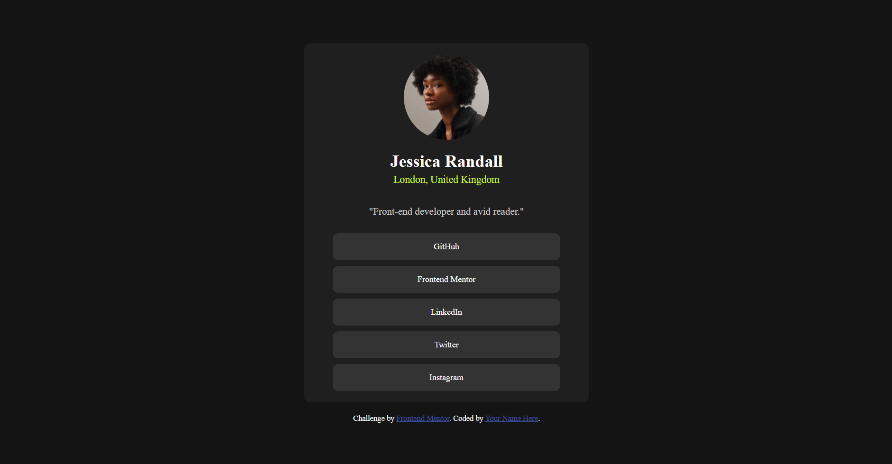

# Frontend Mentor - Social links profile solution

This is a solution to the [Social links profile challenge on Frontend Mentor](https://www.frontendmentor.io/challenges/social-links-profile-UG32l9m6dQ). Frontend Mentor challenges help you improve your coding skills by building realistic projects. 

## Table of contents

- [Overview](#overview)
  - [The challenge](#the-challenge)
  - [Screenshot](#screenshot)
  - [Links](#links)
- [My process](#my-process)
  - [Built with](#built-with)
  - [What I learned](#what-i-learned)
  - [Continued development](#continued-development)
  - [AI Collaboration](#ai-collaboration)
- [Author](#author)


## Overview

### The challenge

Users should be able to:

- See hover and focus states for all interactive elements on the page

### Screenshot



### Links

- Solution URL: [Link Social Page](https://github.com/latefireqwerty/3-Social-Links-Profile)
- Live Site URL: [Add live site URL here](https://your-live-site-url.com)

## My process

### Built with

- Semantic HTML5 markup
- CSS custom properties
- Flexbox
- CSS Grid


### What I learned

I learned that by automatically grouping several elements together in a div, it will make coding cleaner and easier, since I can just type div and all of them will follow the command. I also learned that to make two elements closer vertically, you will need to adjust the margin-bottom of the element above and margin-top of the element below, or else it will go into default and maintain distance.


Below is the example of div

```html
 <div class="GitHub"><p><a href="#">GitHub</a></p></div>
  <div class="Frontend"><p><a href="#">Frontend Mentor</a></p></div>
  <div class="LinkedIn"><p><a href="#">LinkedIn</a></p></div>
  <div class="Twitter"><p><a href="#">Twitter</a></p></div>
  <div class="Instagram"><p><a href="#">Instagram</a></p></div>
```

```css
div{
    margin-top: 0.5rem;
    width: 80%;
}

div:hover{
    background-color: hsl(0, 0%, 30%);
    cursor: pointer;
}
```

This is how I make the distance closer.
```css
img{
    width: 30%;
    border-radius: 50%;
    margin-top: 1rem; 
}

h1{
    color: hsl(0, 0%, 100%);
    font-size:  1.5rem;
    margin-bottom: 0.25rem;
}
```

### Continued development

I still need to practice spacing and making each element responsive to the size of the screen

### AI Collaboration

I used AI to teach me on the spacing between elements in a vertical manner

## Author

- Frontend Mentor - [@latefireqwerty](https://www.frontendmentor.io/home)
- GitHub - [@latefireqwerty](https://github.com/latefireqwerty)


